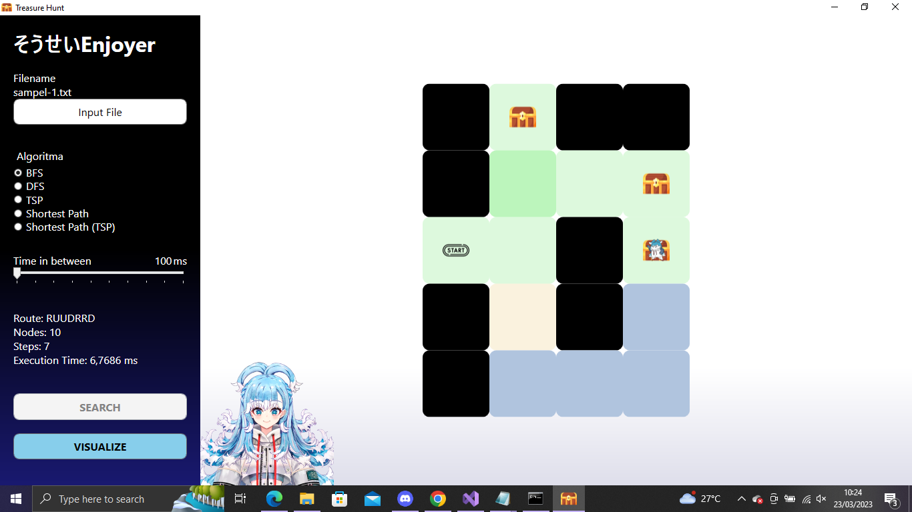

# BFS-DFS Maze Solver Application


This is a project for building a simple GUI application that implements BFS and DFS algorithms to find the route for obtaining all the treasures in a maze. The program can read the maze input from a text file, which is expected to have the following specifications:

- K: Krusty Krab (Starting point)
- T: Treasure
- R: Grid that can be accessed or a path
- X: Obstacle grid that cannot be accessed

The program is built in C# using .NET 6.0 framework.

## Prerequisites

Before you can build and run this program, you will need to have the following tools installed on your system:

- Windows 10 or later
- .NET 6.0 SDK 
- Visual Studio or any other IDE that supports .NET development.

## Build Instructions
1. Clone the project repository to your local machine.
2. Open the command prompt or terminal and navigate to the project's root directory.
3. Run the following command to build the program:
```
dotnet build src/src.csproj
```
4. If the build is successful, the application executable will be generated in the `bin/net6.0-windows` directory.

## How to Use the Program
1. Navigate to the  `bin/net6.0-windows` directory
2. Launch the application by running the following command:
```
dotnet TreasureHuntSolver.dll
```
2. Or you can double click on the `TreasureHuntSolver.exe` file
2. Click the "Input File" button to select the maze text file
3. Select the search algorithm (BFS, DFS, TSP, Shortest Path, or Shortest Path (TSP)) from the control menu.
4. Click the "Search" button to find the route to all treasures.
5. The solution path will be displayed in the control menu
6. Set the time delay for each progress with "Time in between" slider
7. Click the "Visualize" button to visualize the searching process and the final path to all treasures

Here's an explanation for the path's color
- yellow: the path has been accessed
- blue: the path is being accessed
- green: the final path to all treasures

the opacity of the path indicates how often the path accessed by the algorithm/program (kobo)

## Troubleshooting
1. If the build failed because of duplicate assembly code, remove all obj folder in `src/Driver` then rebuild using the build instructions command
2. If the build failed and said "Please restore and try again", run the following command 
```
dotnet restore src/src.csproj
```
3. If you keep getting "Invalid file format" error, make sure the maze text file have the correct format, you can see example text file in the `test` folder

## Author
| NIM  | Name |
| ------------- |:-------------:|
| 13521114      | Farhan Nabil Suryono     |
| 13521120      | Febryan Arota Hia     |
| 13521153      | Made Debby Almadea Putri     |

## Kobo in Krusty Krab


## Credits
- [Treasure icon](https://www.flaticon.com/free-icon/treasure-chest_4883370)
- [Start icon](https://www.flaticon.com/free-icon/start_5199939)
- [Kobo Kanaeru](https://virtualyoutuber.fandom.com/id/wiki/Kobo_Kanaeru)
- [Kobo in Krusty Krab](https://id.pinterest.com/pin/436849232616185460/)